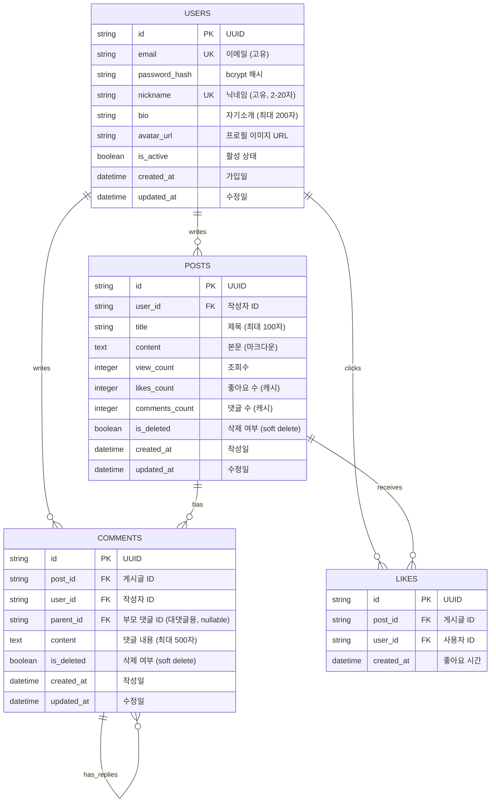

# Database Design: 바이브랩스 커뮤니티

주요 데이터 엔티티와 그 관계를 정의합니다.

## ERD (Entity Relationship Diagram)



## 테이블 상세 명세

### 1. USERS (사용자)

| 컬럼명 | 타입 | 제약조건 | 설명 |
|--------|------|----------|------|
| id | VARCHAR(36) | PK | UUID v4 |
| email | VARCHAR(255) | UNIQUE, NOT NULL | 로그인용 이메일 |
| password_hash | VARCHAR(255) | NOT NULL | bcrypt 해시된 비밀번호 |
| nickname | VARCHAR(20) | UNIQUE, NOT NULL | 표시 닉네임 (2-20자) |
| bio | VARCHAR(200) | NULL | 자기소개 |
| avatar_url | VARCHAR(500) | NULL | 프로필 이미지 URL |
| is_active | BOOLEAN | DEFAULT TRUE | 계정 활성 상태 |
| created_at | DATETIME | DEFAULT NOW | 가입 일시 |
| updated_at | DATETIME | DEFAULT NOW | 수정 일시 |

**인덱스:**
- `idx_users_email` (email) - 로그인 조회 최적화
- `idx_users_nickname` (nickname) - 닉네임 검색 최적화

### 2. POSTS (게시글)

| 컬럼명 | 타입 | 제약조건 | 설명 |
|--------|------|----------|------|
| id | VARCHAR(36) | PK | UUID v4 |
| user_id | VARCHAR(36) | FK -> USERS.id, NOT NULL | 작성자 |
| title | VARCHAR(100) | NOT NULL | 게시글 제목 |
| content | TEXT | NOT NULL | 게시글 본문 (마크다운) |
| view_count | INTEGER | DEFAULT 0 | 조회수 |
| likes_count | INTEGER | DEFAULT 0 | 좋아요 수 (비정규화) |
| comments_count | INTEGER | DEFAULT 0 | 댓글 수 (비정규화) |
| is_deleted | BOOLEAN | DEFAULT FALSE | Soft Delete 플래그 |
| created_at | DATETIME | DEFAULT NOW | 작성 일시 |
| updated_at | DATETIME | DEFAULT NOW | 수정 일시 |

**인덱스:**
- `idx_posts_user_id` (user_id) - 사용자별 게시글 조회
- `idx_posts_created_at` (created_at DESC) - 최신순 정렬
- `idx_posts_likes_count` (likes_count DESC) - 인기순 정렬
- `idx_posts_is_deleted` (is_deleted) - 삭제되지 않은 글 필터

### 3. COMMENTS (댓글/대댓글)

| 컬럼명 | 타입 | 제약조건 | 설명 |
|--------|------|----------|------|
| id | VARCHAR(36) | PK | UUID v4 |
| post_id | VARCHAR(36) | FK -> POSTS.id, NOT NULL | 소속 게시글 |
| user_id | VARCHAR(36) | FK -> USERS.id, NOT NULL | 작성자 |
| parent_id | VARCHAR(36) | FK -> COMMENTS.id, NULL | 부모 댓글 (대댓글인 경우) |
| content | VARCHAR(500) | NOT NULL | 댓글 내용 |
| is_deleted | BOOLEAN | DEFAULT FALSE | Soft Delete 플래그 |
| created_at | DATETIME | DEFAULT NOW | 작성 일시 |
| updated_at | DATETIME | DEFAULT NOW | 수정 일시 |

**인덱스:**
- `idx_comments_post_id` (post_id) - 게시글별 댓글 조회
- `idx_comments_parent_id` (parent_id) - 대댓글 조회
- `idx_comments_user_id` (user_id) - 사용자별 댓글 조회

**대댓글 규칙:**
- `parent_id`가 NULL이면 일반 댓글
- `parent_id`가 있으면 대댓글 (1단계만 허용)
- 대댓글에 대한 대댓글은 허용하지 않음 (parent의 parent가 NULL인 경우만 대댓글 작성 가능)

### 4. LIKES (좋아요)

| 컬럼명 | 타입 | 제약조건 | 설명 |
|--------|------|----------|------|
| id | VARCHAR(36) | PK | UUID v4 |
| post_id | VARCHAR(36) | FK -> POSTS.id, NOT NULL | 좋아요 대상 게시글 |
| user_id | VARCHAR(36) | FK -> USERS.id, NOT NULL | 좋아요 누른 사용자 |
| created_at | DATETIME | DEFAULT NOW | 좋아요 일시 |

**제약조건:**
- `UNIQUE(post_id, user_id)` - 중복 좋아요 방지

**인덱스:**
- `idx_likes_post_id` (post_id) - 게시글별 좋아요 조회
- `idx_likes_user_id` (user_id) - 사용자별 좋아요 조회
- `idx_likes_created_at` (created_at) - 랭킹 기간별 조회

## SQLAlchemy 모델 예시

```python
# models/user.py
from sqlalchemy import Column, String, Boolean, DateTime
from sqlalchemy.orm import relationship
from datetime import datetime
import uuid

class User(Base):
    __tablename__ = "users"

    id = Column(String(36), primary_key=True, default=lambda: str(uuid.uuid4()))
    email = Column(String(255), unique=True, nullable=False, index=True)
    password_hash = Column(String(255), nullable=False)
    nickname = Column(String(20), unique=True, nullable=False, index=True)
    bio = Column(String(200), nullable=True)
    avatar_url = Column(String(500), nullable=True)
    is_active = Column(Boolean, default=True)
    created_at = Column(DateTime, default=datetime.utcnow)
    updated_at = Column(DateTime, default=datetime.utcnow, onupdate=datetime.utcnow)

    # Relationships
    posts = relationship("Post", back_populates="author")
    comments = relationship("Comment", back_populates="author")
    likes = relationship("Like", back_populates="user")
```

```python
# models/post.py
class Post(Base):
    __tablename__ = "posts"

    id = Column(String(36), primary_key=True, default=lambda: str(uuid.uuid4()))
    user_id = Column(String(36), ForeignKey("users.id"), nullable=False)
    title = Column(String(100), nullable=False)
    content = Column(Text, nullable=False)
    view_count = Column(Integer, default=0)
    likes_count = Column(Integer, default=0)
    comments_count = Column(Integer, default=0)
    is_deleted = Column(Boolean, default=False)
    created_at = Column(DateTime, default=datetime.utcnow, index=True)
    updated_at = Column(DateTime, default=datetime.utcnow, onupdate=datetime.utcnow)

    # Relationships
    author = relationship("User", back_populates="posts")
    comments = relationship("Comment", back_populates="post")
    likes = relationship("Like", back_populates="post")
```

```python
# models/comment.py
class Comment(Base):
    __tablename__ = "comments"

    id = Column(String(36), primary_key=True, default=lambda: str(uuid.uuid4()))
    post_id = Column(String(36), ForeignKey("posts.id"), nullable=False)
    user_id = Column(String(36), ForeignKey("users.id"), nullable=False)
    parent_id = Column(String(36), ForeignKey("comments.id"), nullable=True)
    content = Column(String(500), nullable=False)
    is_deleted = Column(Boolean, default=False)
    created_at = Column(DateTime, default=datetime.utcnow)
    updated_at = Column(DateTime, default=datetime.utcnow, onupdate=datetime.utcnow)

    # Relationships
    post = relationship("Post", back_populates="comments")
    author = relationship("User", back_populates="comments")
    parent = relationship("Comment", remote_side=[id], backref="replies")
```

```python
# models/like.py
from sqlalchemy import UniqueConstraint

class Like(Base):
    __tablename__ = "likes"
    __table_args__ = (
        UniqueConstraint('post_id', 'user_id', name='uq_likes_post_user'),
    )

    id = Column(String(36), primary_key=True, default=lambda: str(uuid.uuid4()))
    post_id = Column(String(36), ForeignKey("posts.id"), nullable=False)
    user_id = Column(String(36), ForeignKey("users.id"), nullable=False)
    created_at = Column(DateTime, default=datetime.utcnow, index=True)

    # Relationships
    post = relationship("Post", back_populates="likes")
    user = relationship("User", back_populates="likes")
```

## 데이터 정합성 규칙

### Soft Delete 정책
- 게시글/댓글 삭제 시 `is_deleted = TRUE`로 설정
- 조회 시 `is_deleted = FALSE` 조건 항상 적용
- 실제 삭제는 주기적인 배치 작업으로 처리 (MVP에서는 생략 가능)

### 카운트 캐싱
- `posts.likes_count`: 좋아요 추가/삭제 시 트리거로 업데이트
- `posts.comments_count`: 댓글 추가/삭제 시 트리거로 업데이트
- 정합성 검증: 주기적으로 실제 카운트와 비교 (선택사항)

### 대댓글 깊이 제한
- 댓글 생성 시 `parent_id` 검증
- `parent`의 `parent_id`가 NULL인 경우만 대댓글 허용
- 이를 통해 1단계 대댓글만 가능하도록 제한

## 랭킹 쿼리 예시

```sql
-- 일간 인기 게시글 (오늘 받은 좋아요 기준)
SELECT p.*, COUNT(l.id) as today_likes
FROM posts p
LEFT JOIN likes l ON p.id = l.post_id
    AND l.created_at >= date('now', 'start of day')
WHERE p.is_deleted = FALSE
GROUP BY p.id
ORDER BY today_likes DESC
LIMIT 10;

-- 주간 인기 사용자 (이번 주 받은 좋아요 기준)
SELECT u.id, u.nickname, u.avatar_url, COUNT(l.id) as weekly_likes
FROM users u
JOIN posts p ON u.id = p.user_id
LEFT JOIN likes l ON p.id = l.post_id
    AND l.created_at >= date('now', '-7 days')
WHERE p.is_deleted = FALSE
GROUP BY u.id
ORDER BY weekly_likes DESC
LIMIT 10;
```
