# User Flow: 바이브랩스 커뮤니티

핵심 기능별 사용자 여정을 정의합니다.

## 1. 인증 플로우

### 1.1 회원가입

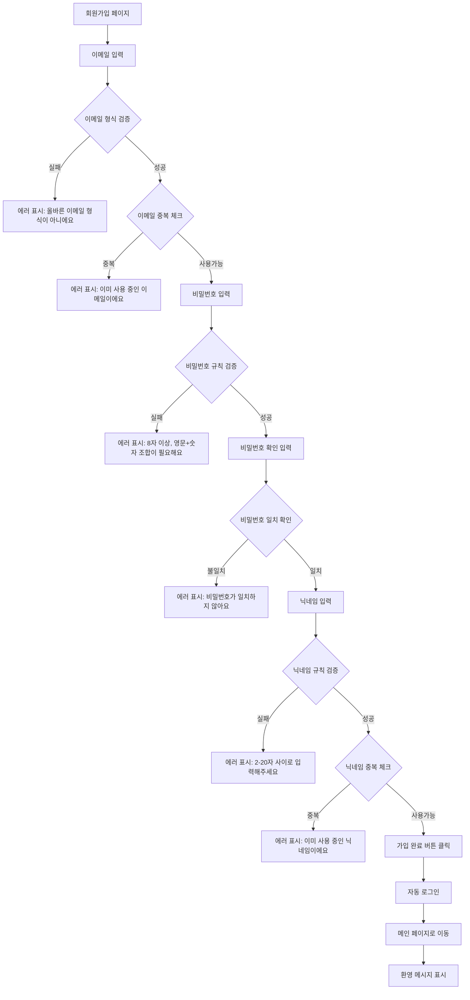

### 1.2 로그인

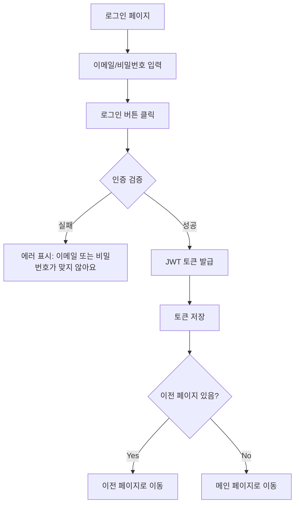

### 1.3 로그아웃

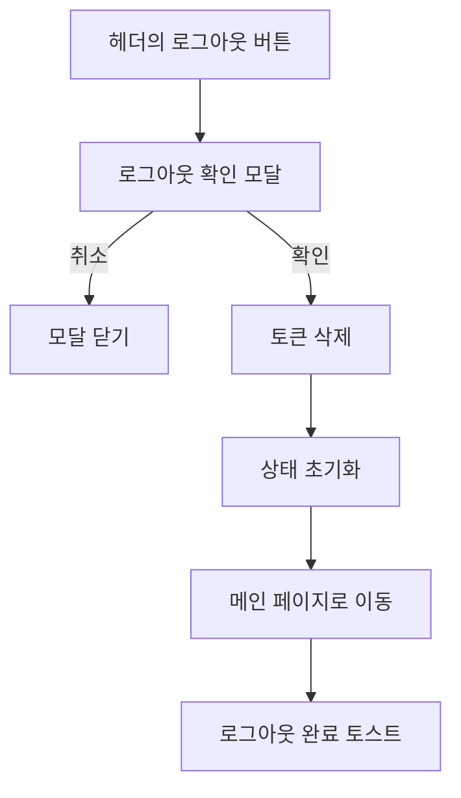

## 2. 프로필 플로우

### 2.1 프로필 조회

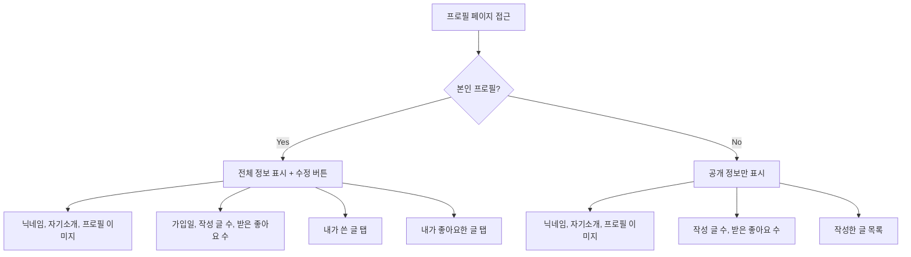

### 2.2 프로필 수정

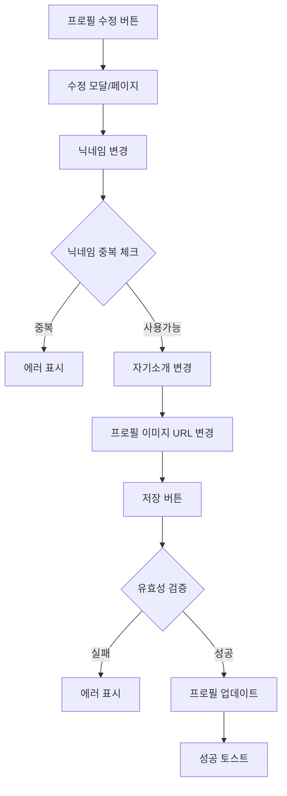

### 2.3 비밀번호 변경

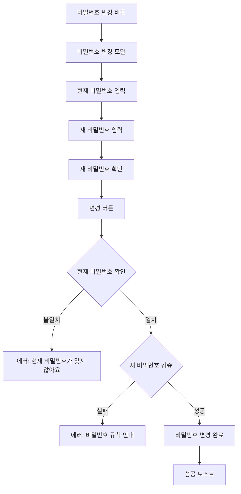

## 3. 게시판 플로우

### 3.1 글 목록 조회

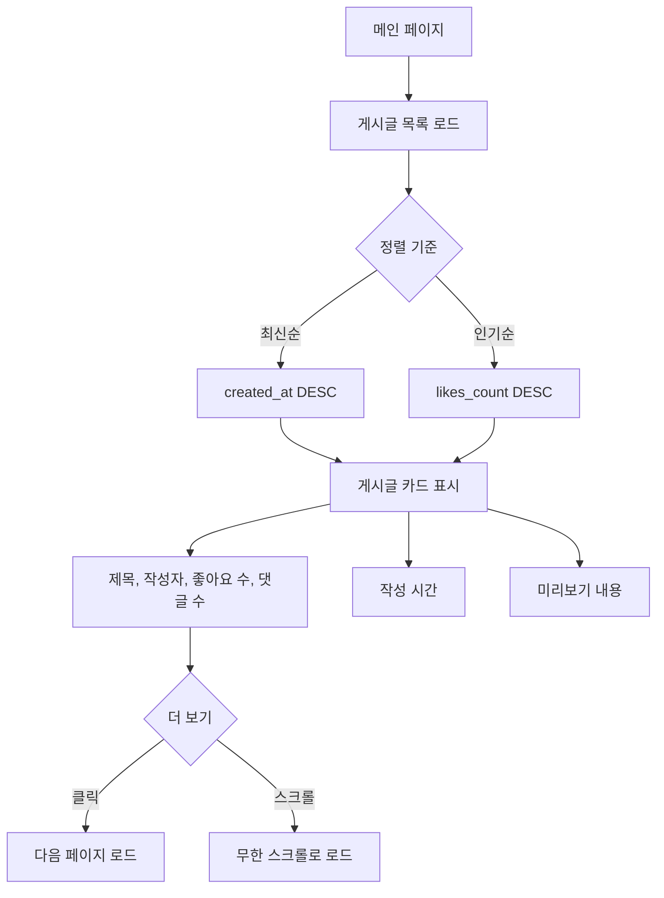

### 3.2 글 작성

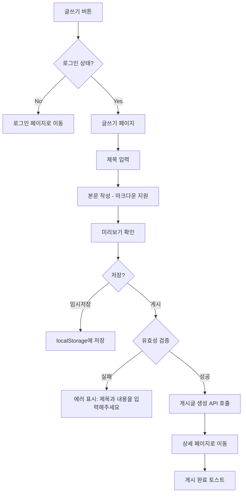

### 3.3 글 상세 조회

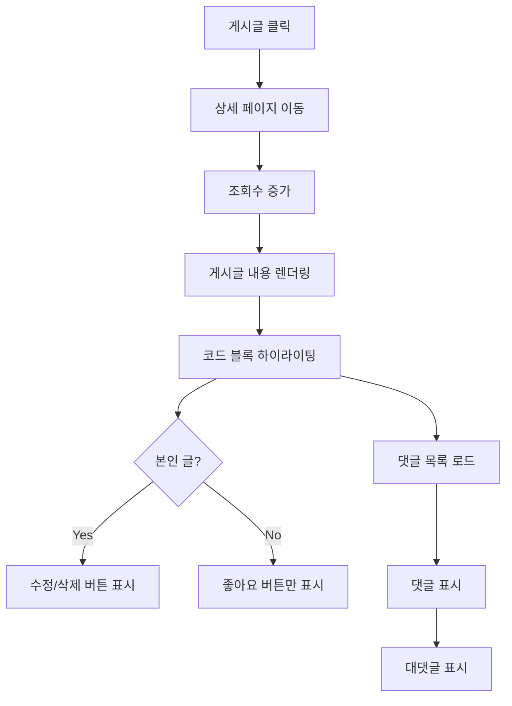

### 3.4 글 수정

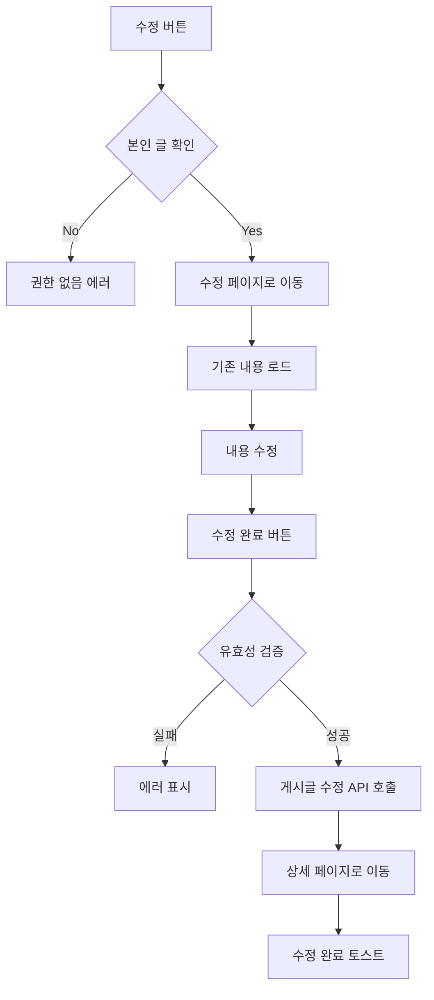

### 3.5 글 삭제

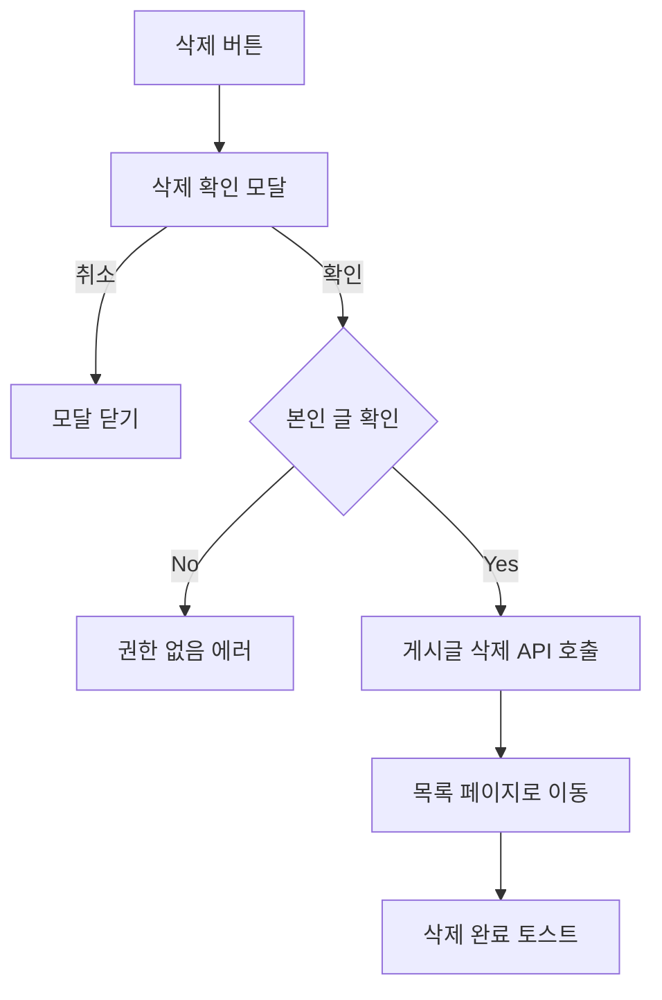

## 4. 댓글/대댓글 플로우

### 4.1 댓글 작성

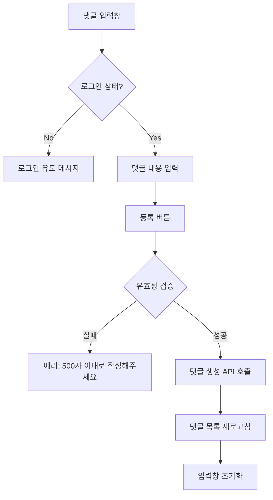

### 4.2 대댓글 작성

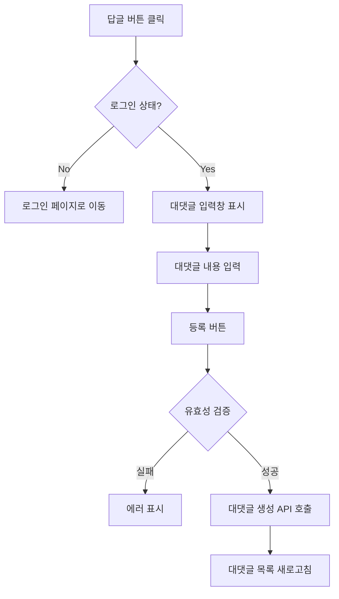

### 4.3 댓글 수정/삭제

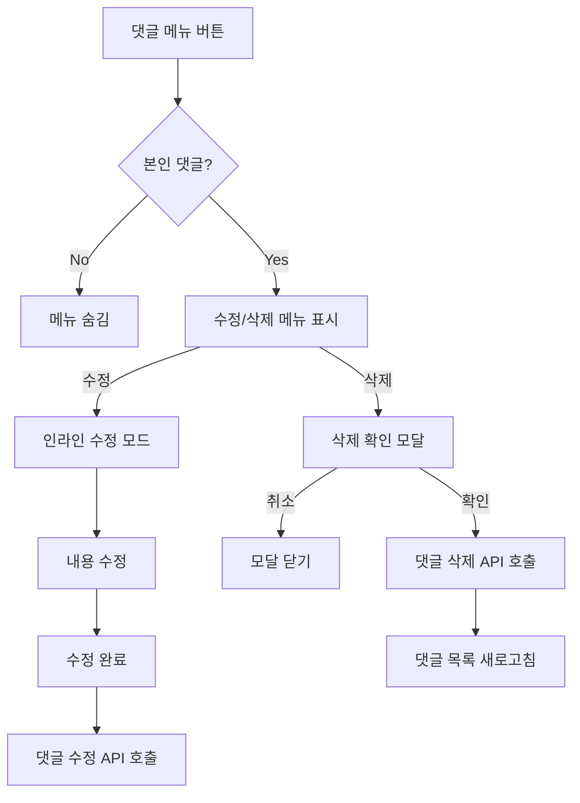

## 5. 좋아요 플로우

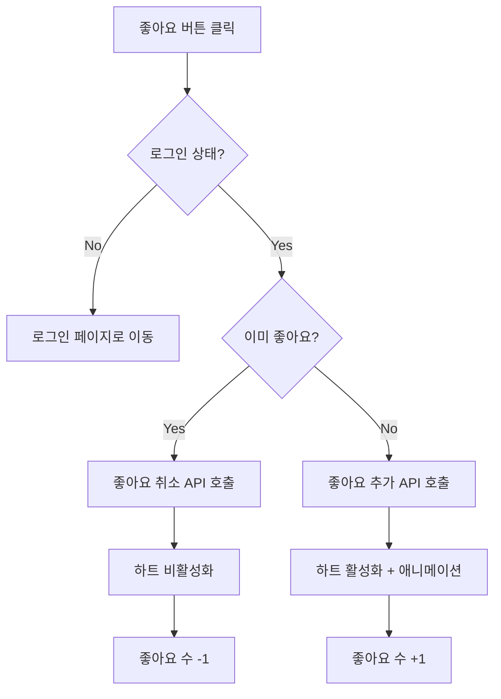

## 6. 랭킹 플로우

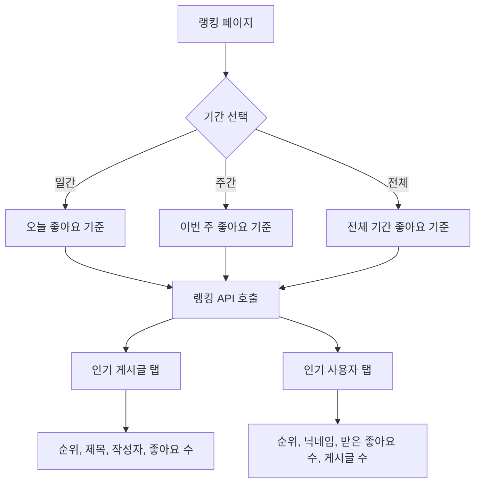

## 7. 주요 화면 설명

### 7.1 헤더 (Header)
| 상태 | 표시 요소 |
|------|-----------|
| 비로그인 | 로고, 로그인 버튼, 회원가입 버튼 |
| 로그인 | 로고, 글쓰기 버튼, 알림 아이콘, 프로필 드롭다운 |

### 7.2 메인/목록 페이지
- "오늘의 열정"을 한눈에 볼 수 있는 활기찬 카드 레이아웃
- 정렬 옵션: 최신순 / 인기순
- 무한 스크롤 또는 페이지네이션

### 7.3 글쓰기 페이지
- 방해 요소 없는 몰입형 에디터
- 마크다운 미리보기 지원
- 다정한 가이드 메시지 (placeholder)

### 7.4 상세 페이지
- 코드 블록이 예쁘게 렌더링
- 하단에 '응원 릴레이(댓글)'가 이어지는 구조
- 대댓글 1단계 들여쓰기 표시

### 7.5 랭킹 페이지
- "이주의 열정 왕" 캐릭터가 배지를 달고 나타남
- 탭으로 게시글/사용자 랭킹 전환
- 기간 필터 (일간/주간/전체)

### 7.6 프로필 페이지
- 프로필 카드 (이미지, 닉네임, 자기소개)
- 통계 (작성 글 수, 받은 좋아요 수)
- 탭: 내가 쓴 글 / 좋아요한 글

## 8. 에러 처리 가이드라인

| 상황 | 메시지 예시 |
|------|-------------|
| 네트워크 오류 | "연결이 불안정해요. 잠시 후 다시 시도해주세요." |
| 권한 없음 | "이 작업을 수행할 권한이 없어요." |
| 존재하지 않는 페이지 | "앗, 찾으시는 페이지가 없어요. 다른 곳을 둘러보시겠어요?" |
| 세션 만료 | "다시 로그인해주세요." |
| 서버 오류 | "잠시 문제가 생겼어요. 곧 해결할게요!" |
